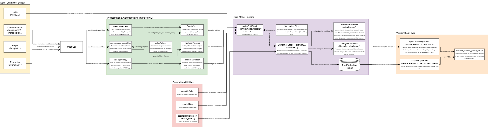

# OpenFold-based Attention Visualization Demo

This is a lightweight extension of [OpenFold](https://github.com/aqlaboratory/openfold) that enables interactive visualization of attention mechanisms in protein structure prediction. It provides tools to render MSA row and Triangle attention scores as:

- Arc diagrams (sequence space)
- 3D PyMOL overlays (structure space)

---

## Key Features

- Compatible with OpenFold outputs (`.pdb`, attention text dumps)
- Support for layer- and head-specific visualizations
- Integrated residue highlighting
- Notebook-friendly and HPC-friendly workflow

---

## Architecture Overview

AttentionViz layers three lightweight components on top of upstream OpenFold:
- **Workflow assets** (docs, scripts, notebooks) provide reproducible configs and runnable examples.
- **Instrumented CLIs** wrap OpenFold inference/training so attention tensors are siphoned off without modifying the scientific core.
- **Visualization helpers** read the exported metadata and generate PyMOL overlays plus sequence-space plots for exploratory analysis.

The diagram captures how these pieces interact and what artifacts move between them.



- [High-res PDF](./docs/imgs/AttentionViz_Architecture.pdf) for zooming/printing
- [Editable SVG](./docs/imgs/AttentionViz_Architecture.svg) when updating the diagram source

---

## Installation

This repo assumes you have already installed [OpenFold and its dependencies](https://openfold.readthedocs.io/en/latest/Installation.html), or you are using CyberShuttle (see `cybershuttle.yml`)
You will also need:
- `PyMOL` (open-source version is sufficient)
- `matplotlib`, `numpy`, `scipy`, `pandas`
- `biopython` (for sequence parsing)

You can also install the full set of dendencies (including those for OpenFold) from our `cybershuttle.yml` file directly.
Beyond confirming the proper installation of OpenFold, you can test the specific dependendices for our repo by using:
```
import os
import numpy as np
import matplotlib.pyplot as plt
import csv
from pymol import cmd
from pymol.cgo import CYLINDER, SPHERE
```

---

## Interactive Demo: `viz_attention_demo_base.ipynb`

The notebook `viz_attention_demo_base.ipynb` demonstrates the full visualization pipeline using OpenFold.

It performs the following steps:

1. **Runs inference** using OpenFold with precomputed alignments
2. **Extracts top-k residue-residue attention scores** from each layer and head
3. **Saves these scores** to text files
4. **Visualizes attention**:
   - As **arc diagrams** (residue-residue attention on the sequence)
   - As **3D PyMOL overlays** (on the predicted structure)

We focus on two attention types:
- **MSA Row Attention**
- **Triangle Start Attention**

> The **thickness of the lines** (in both arc diagrams and 3D renderings) indicates the **strength of the attention score**.

(If using Cybershuttle, then please use `viz_attention_demo.ipynb`)

---

### MSA Row Attention (Layer 47, Protein 6KWC)

- Shows pairwise attention between residues as inferred from multiple sequence alignments
- Visualized across all attention heads at a selected model layer

Arc diagram (Head 2):


All heads subplot:


---

### Triangle Start Attention (Layer 47, Residue 18)

- Focuses on attention **from a single residue to others**, as part of triangle-based geometric reasoning
- The **selected residue is highlighted**:
  - In arc diagrams: using a **blue label**
  - In 3D visualizations: using a **sphere**

Arc diagram (Head 0):


All heads subplot:


## Acknowledgements

This project is based on [**OpenFold**](https://github.com/aqlaboratory/openfold), an open-source reimplementation of AlphaFold, distributed under the [Apache License 2.0](https://www.apache.org/licenses/LICENSE-2.0).

We have extended OpenFold with:
- Custom visualization tools for attention maps (3D + arc diagrams)
- Demo scripts and configuration for interactive analysis
- Modifications to the inference pipeline for simplified usage

This repository includes source code originally developed by the OpenFold contributors. All original rights and attributions are retained in accordance with the Apache 2.0 License.

---

## PACE ICE (GT HPC) Setup

> Installs to **SCRATCH** (not HOME), builds OpenFold, and sets up the attention demo. Run on a **GPU node** you allocate with Slurm.

### 0) Get a GPU node
```bash
# from a login node
salloc -p ice-gpu --gres=gpu:1 --cpus-per-task=8 --mem=32G -t 02:00:00
# when the shell drops onto the compute node, continue below
```

### 1) Initialize tools and clone repos

```bash
module load mamba
source /usr/local/pace-apps/manual/packages/miniforge/24.3.0-0/etc/profile.d/conda.sh

git clone https://github.com/vizfold/attention-viz-demo.git ~/scratch/attention-viz-demo
git clone https://github.com/aqlaboratory/openfold.git       ~/scratch/openfold

cd ~/scratch/openfold
```

### 2) Use SCRATCH for env & cache, then create env with Mamba

```bash
export SCRATCH_ROOT=/storage/ice1/2/0/$USER
mkdir -p "$SCRATCH_ROOT/conda-pkgs" "$SCRATCH_ROOT/envs"
export CONDA_PKGS_DIRS="$SCRATCH_ROOT/conda-pkgs"
export ENV_PREFIX="$SCRATCH_ROOT/envs/openfold_env"

mamba env create -p "$ENV_PREFIX" -f environment.yml
conda activate "$ENV_PREFIX"
```

### 3) Compiler & library paths for CUDA extension build

```bash
mkdir -p "$CONDA_PREFIX/x86_64-conda-linux-gnu/lib"
ln -sf "$CONDA_PREFIX/libexec/gcc/x86_64-conda-linux-gnu/12.4.0/cc1plus" "$CONDA_PREFIX/bin/"
ln -sf "$CONDA_PREFIX/lib/gcc/x86_64-conda-linux-gnu/12.4.0/crtbeginS.o" "$CONDA_PREFIX/x86_64-conda-linux-gnu/lib/crtbeginS.o"
ln -sf "$CONDA_PREFIX/lib/gcc/x86_64-conda-linux-gnu/12.4.0/crtendS.o"   "$CONDA_PREFIX/x86_64-conda-linux-gnu/lib/crtendS.o"
ln -sf "$CONDA_PREFIX/x86_64-conda-linux-gnu/sysroot/usr/lib64/crti.o"   "$CONDA_PREFIX/x86_64-conda-linux-gnu/lib/crti.o"
ln -sf "$CONDA_PREFIX/x86_64-conda-linux-gnu/sysroot/usr/lib64/crtn.o"   "$CONDA_PREFIX/x86_64-conda-linux-gnu/lib/crtn.o"

mamba install -y -c conda-forge gcc_linux-64 libgcc-ng

export GCC_LTO_PLUGIN="$CONDA_PREFIX/libexec/gcc/x86_64-conda-linux-gnu/12.4.0/liblto_plugin.so"
export CFLAGS="-O2 -fno-lto --sysroot=$CONDA_PREFIX/x86_64-conda-linux-gnu/sysroot"
export CXXFLAGS="$CXXFLAGS -fno-use-linker-plugin -O2 -fno-lto --sysroot=$CONDA_PREFIX/x86_64-conda-linux-gnu/sysroot"
export LDFLAGS="$LDFLAGS -fno-use-linker-plugin -O2 -fno-lto --sysroot=$CONDA_PREFIX/x86_64-conda-linux-gnu/sysroot"
export LDFLAGS="$LDFLAGS -L$CONDA_PREFIX/lib/gcc/x86_64-conda-linux-gnu/12.4.0 -L$CONDA_PREFIX/x86_64-conda-linux-gnu/sysroot/usr/lib64"

# Optional: target your node’s GPU arch (A100: 8.0, A40/L40S: 8.6, V100: 7.0, RTX 6000 (Turing): 7.5)
export TORCH_CUDA_ARCH_LIST="8.0"
```

### 4) Install OpenFold (build CUDA kernels) and third-party assets

```bash
cd ~/scratch/openfold
pip install -e .
scripts/install_third_party_dependencies.sh
```

### 5) Jupyter kernel & data links for the demo

```bash
mamba install -y ipykernel
python -m ipykernel install --user --name=openfold_env

cd ~/scratch/attention-viz-demo
ln -s ~/scratch/openfold/openfold/data ./openfold/

mkdir -p openfold/resources
ln -s /storage/ice1/shared/d-pace_community/alphafold/alphafold_2.3.2_data/params ./openfold/resources/

wget -N --no-check-certificate -P openfold/resources \
  https://git.scicore.unibas.ch/schwede/openstructure/-/raw/7102c63615b64735c4941278d92b554ec94415f8/modules/mol/alg/src/stereo_chemical_props.txt
```

### 6) Visualization extras

```bash
mamba install -y conda-forge::matplotlib

# Optional: make solves reproducible
conda config --set channel_priority strict

mamba install -y pytorch==2.5.0 pytorch-cuda=12.4 -c pytorch -c nvidia
mamba install -y -c conda-forge -c pytorch -c nvidia pymol-open-source

# Optional: undo the strict setting
conda config --remove-key channel_priority || true
```

**Notes**

* Run installs/builds **on a GPU node** (the environment needs CUDA to compile OpenFold’s extension).
* Env and package caches live under `/storage/ice1/2/0/$USER` to avoid HOME quota issues.
* If a build fails, re-`conda activate "$ENV_PREFIX"` and re-run steps **3–4**.

---

## License

This project is licensed under the [Apache License 2.0](https://www.apache.org/licenses/LICENSE-2.0).  
See the [LICENSE](./LICENSE) file for details.

---
